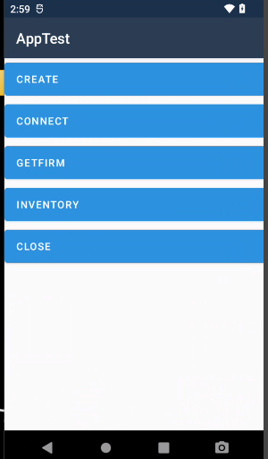

# rodinbell-handhelp-bluetooth-xamarin
rodinbell Bluetooth handhelp xamarin

## 1. init a Reader : 
        mrdUHFModule.CreateReader(nameid);

## 2. connect Reader : 
        JObject jobj = new JObject
        {
            {"method", "connectDevice"},

        };
        string connectstr = jobj.ToString();

        Thread thread = new Thread(() =>
        {
            Console.WriteLine("connect ===" + Thread.CurrentThread.ManagedThreadId);
            var res = mrdUHFModule.CallReaderUhf(nameid, connectstr);
            Console.WriteLine("connect End == " +res);
        });
        thread.Start();

## 3. get firmware info :
        JObject jobj = new JObject
        {
            {"method", "getFirmwareVersion"},
        };
        string getfirmstr = jobj.ToString();
        var res = mrdUHFModule.CallReaderUhf(nameid, getfirmstr);

## 4. inventory : 
        JObject jobj = new JObject
        {
            {"method", "customInventory"},
        };
        string inventorystr = jobj.ToString();
        var res = mrdUHFModule.CallReaderUhf(nameid, inventorystr);

## 5. close : 
        mrdUHFModule.DestroyReader(nameid);

 

    
  